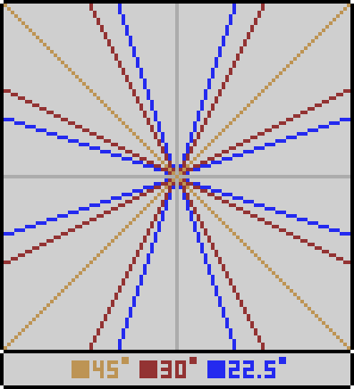
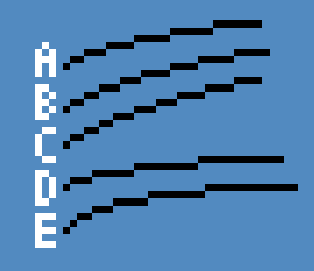
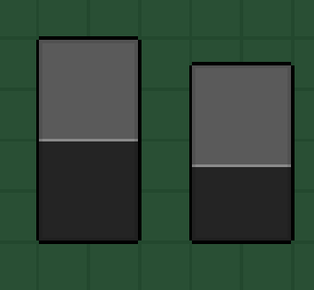
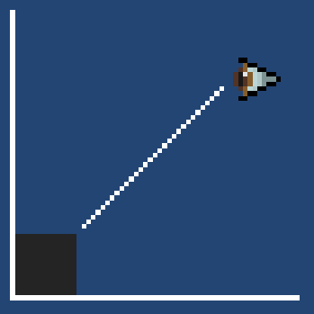
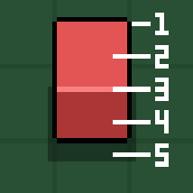

# Whiteverse 设计标准

## 环境配置

- Photoshop 版本大于 2020
- 将图像插值调整为邻近
  
- 将高速缓存级别调至 2，高速缓存拼贴大小调至 128k，历史记录随意（取决于用户电脑配置）。
  
- 将标尺与文字单位调整为像素
  
- 使用铅笔工具绘画，关闭平滑，否则会导致画笔延迟漂移
  
- 使用油漆桶进行范围填色，容差调整为 0，禁用消除锯齿，连续选项视情况而定
  
- 使用橡皮工具进行修改，切换到铅笔模式
  
- 在执行图像缩放时，需要注意三点：
  - 为保证放大的像素不因奇偶差异而变形，应当通过调整图像的放大中心为左上 👉 使其 XY 坐标定位达到像素精确（例：10.00 像素）。
  - 应当使图像的放大倍数为整数倍，如 200%、300%，而非 150%或 112%
  - 插值必须调整为邻近
    

## 绘图习惯

使用 Photoshop 进行绘图时，伴随软件特性产生的一些问题，需要特别注意。以下是一些常见的问题和解决方案：

### 斜线

像素画中的直线是由一系列的等长线段构成的。在像素画中，角度与线段的关系是这样的：



一般来说，在绘制角度时，应当遵循以下规则：

1. 22.5°(1/16)、30°(1/12)、45°(1/8)、60°(1/6)、90°(1/4)、是最基本的角度，应当尽量避免使用其他角度。
   由于像素的特性，这些角度可以保证线段的长度是整数像素，这样可以保证线段的清晰度。
   135°、225°、315° 是 45° 的倍数，也是可以接受的角度。
2. 像素线段长度和角度存在这样的关系：

```math
length = 90/angle - 1
```

这个公式可以帮助我们计算出在绘制特定角度时，线段的长度应当是多少。而该公式表明了一个重要的事实：在绘制介于 30° 到 60° 之间的角度时，线段的长度会产生不完美的像素，这是因为在这个范围内，线段的长度不是整数像素，这样会导致线段的不完美。应当尽量通过其他方式避免这种情况。


红色部分是危险区域，绿色部分是安全区域。在绘制时，应当尽量避免使用危险区域的角度。
当不得不使用危险区域的角度时，可以通过曲线来代替直线，这样可以一定程度上避免问题产生。

### 曲线

像素画中的曲线是由一系列长度等差的线段构成的。在像素画中，曲线的绘制是一个复杂的问题，因为曲线的长度和角度都会影响曲线的质量。

一个平滑的曲线中的线段长度 y 与线段次数 x 存在一定的相关性：



```math
A: y = x
B: y = [n/2]
C: y = [(n+1)/3]
D: y= 3n-2
E: 斐波那契数列
```

由此可得出推论：

1. 曲线一定符合数列规律，可以通过数列规律来推断曲线的长度。
2. 曲线的线段长度应当是整数像素，即使需要取整符号。

### 圆

在 Photoshop 中，如果使用**铅笔**进行圆的绘制，需要注意的是，笔刷的大小决定了圆的直径，基于此，圆必须是**奇数**像素，这样才能保证圆心在像素上。如果是偶数像素，圆心会落在像素之间，导致圆的不完美。
如果想要绘制直径为偶数像素的圆，可以通过绘制直径为奇数像素的圆，然后通过框选工具进行裁剪，这样可以保证圆心在像素上。


如图所示， 直径个位为 3~5、5~7 的圆之间有明显的阶梯感，它的最长线段长度会突变。
直径个位为 3 和 7 的圆存在像素不完美问题，需要手动调整修边。本图是已经修复后的。

### 视角 ⚠️

在像素画中，视角是一个重要的概念，它决定了物体的组成方式和绘制方式。
一个项目一般会有一个固定的视角，这样可以保证整个项目的一致性。

#### Top-down 俯视视角

摄像机以固定角度观察被摄物体，在这种视角下，物体拥有两个面，一个是顶面，一个是立面。为了表现物体的立体感，除了两个面的对比度、高光（第三面）之外，还应该在设计图案的时候做好体积暗示。

##### 高度问题

一个占地面积 2x2(x16)的立方体物体，高度为 2(x16)。那么问题来了，这个物体在实际绘制时它的立面和顶面的像素是怎么分配的呢？



如图所示，如果立面的像素长度按照本身的设计长度绘制，在俯视视角下它的体积不能被传达到位，因为摄像机的视角是 40°~45° 角(≈41.41∘)倾斜于地面的。



所以在尽可能保留顶面原大小的同时，立面的像素长度应当缩短，这样可以更好的传达物体的体积。缩短的公式如下：

```math
height' =  height * 3/4
```

对于像素游戏，视觉上的 3/4 视角通常通过美术调整，而不是依赖于精确的 3D 透视算法。角色和场景素的高度通常由手工像素美术来决定。

##### 光照来源



1. 描边：一般情况下不进行绘制；
2. 顶面：受光面，物体的固有色；
3. 高光：物体中最亮的部分；
4. 立面：不受光的面，物体固有色的亮度降低版本。可能存在反光，反光挤压明暗交界线；
5. 投影：左右比形体各扩展 2px，以保证在有描边的情况下投影仍然能够正确显示。

俯视视角的光照来源无论在任何情况下都是默认顶光，且无色温影响。这代表了任何一个物体都**不应该**受光源着色，即是说，物体的亮暗面都是灰调的。

上述说法仅用于拥有后处理过程的游戏引擎，引擎会自动为物体进行光照上色。在其他绘制场景中，仍然需要对亮暗面进行色彩冷暖的调整。

死区缺陷问题 https://zhuanlan.zhihu.com/p/686230441

#### Isometric 等距视角

待完善。

#### Scroll-side 卷轴视角

卷轴视角的摄像机平行于被摄物体，这导致物体的立体感不明显。物体拥有 1~2 个面：有时作为背景的物体垂直于摄影机，只展示一个面，但是即便事实上垂直于摄影机的场合，也可能为了照顾体积感而绘制两个面。

这与摄影机的距离有一定的关系，距离越近，体积感越强；距离越远，露出的面就约少。

卷轴视角的光照来源本应是顶光，但是角度问题导致卷轴视角的物体没有顶面，因此我们在项目建立时就确定好光照来源（于左侧或是右侧）

一般情况下我们会选择左侧光源。但是某些环境自带光的情况下需要对亮暗面进行调整，甚至使用法线贴图。不过大部分情况下，这是不必要的——玩家往往不会注意到这些细节。


如图所示，这是一个通过亮暗面加上些微的边缘宽度调整体现物体体积的例子。

大部分情况下，光照射进场景的范围是有限的，距离稍远的物体受光影响较小。另外，远处的物体的颜色应当更灰，以表现大气的影响。但是这存在例外。在某些情况下，极远处的物体应当更亮，以表现远处的外部光源，如远山、远处的建筑等，这些物体应当更亮、融入天空。

#### Free 自由视角

待完善。

### 置入

痛点：

1. 直接置入会因为坐标重置、DPI 自动调整等原因偏移图片的周围像素；
2. 如果通过复制图层的方式无损置入，会丢失图片的名称；

最优解：先通过引擎或其他 Batch 方式给需要的图片加上透明描边，然后统一拖入 Photoshop 中，这样可以保证图片的描边一致性。

python 代码如下：

```python
from PIL import Image
def add_border_if_needed(image_path, border_color=(255, 255, 255)):
    img = Image.open(image_path)
    width, height = img.size
    corners = [img.getpixel((0, 0)), img.getpixel((width-1, 0)), img.getpixel((0, height-1)), img.getpixel((width-1, height-1))]
    if all(corner == border_color for corner in corners):
        print("Image already has a border. No changes made.")
        return

    new_img = Image.new("RGB", (width+2, height+2), border_color)
    new_img.paste(img, (1, 1))
    new_image_path = "bordered_" + image_path
    new_img.save(new_image_path)
    print(f"Image saved with border as {new_image_path}")
image_path = "path/to/your/image.jpg"
add_border_if_needed(image_path)
```

在 Photoshop 中，图片的批量置入需要注意以下几点：

- 原始文档的 DPI 需要与置入图片的 DPI 一致，否则会导致图片的像素丢失——即使在设置中设定了“不缩放”；
- 应当在设置中将置入的图片自动转换为智能对象，以便于后续的修改；
- 置入后，应当选择智能对象，并右键图层，选择“恢复缩放”以保证图片的原始尺寸。

### 图层

- 不同物体需要分层。
- 在设计上有特别的的叠压关系时应当单独分图层，如侧面的阳台。
- 允许合层的情况：

- 不影响结构整体性的
- 不影响或没有交互方式的
- 可以作为整体 SpriteSheet 裁切的

- 图层命名必须统一且明确，名称采用大驼峰，并用下划线连接名称和它的属性，如 Shadow、Back、Front、Frame 等字段。出现“图层”“拷贝”等名称是**不被允许**的，这样的图层不应当加入导出序列，仅用作指示画面效果。下面是一个例子：

- House_Back
- House_Front
- House_Frame_1
- House_Frame_2
- House_Texture
- House_Shadow

在导出时，也应当遵循这一规则，以保证导出的文件名和图层名称一致。

- 可以定义图层名称属性的缩写，应当说明。以下是一些常用的缩写和意义：
  |缩写|英文|含义|
  |---|---|---|
  | b |back |背后 |
  | f |front |前，可省略 |
  | s |side| 侧面 |
  | w |shadow |投影 |
  | t |texture |材质、纹理 |

### 描边

- 在设计时应当保留物品的边缘尺寸，以便于在游戏中添加自动描边。举例说明：在绘制一个 32x32 的物品时，应当在物品的边缘留出** 1px 的空白**，也就是说物品的实际尺寸为 30x30，这样在游戏中添加描边时就不会出现物品之间的重叠。
- 以下情况**绝不允许**：
- 使用现实的图片直接作为底图描绘，再在上面进行修改。
- 除非有特殊需求，绘制时半透明笔刷直接出现在画布上。这会导致游戏中颜色自动描边后的异常混合。
- 当一组物体的描边是选择性的，整体中存在不需要描边的地方，应当在预定的描边位置绘制**alpha = 10% ~ 20%**的黑色，引擎会自动识别并将此处颜色重设为**全透明黑色**。
- 当一组物体的描边是不需要的，就不必再预留 alpha，直接绘制即可。

### 投影

- 投影一般情况下**alpha = 33%**，颜色为黑色。如果主体有描边，投影应该在两侧扩展至少**1px**，以保证投影的完整性。
- 如果一个物体的投影是选择性的，已经在主体上绘制了硬性投影（环境光遮蔽），仍然需要导出相应的投影文件，该文件可以是空图片。

### 发光贴图

由于采用了 URP 渲染管线，我们可以使用 Emission Map 来实现发光效果。

需要为发光部分单独绘制一张贴图，贴图的尺寸应当与主体贴图一致。在需要发光的位置用任何需要的颜色标注，其明亮程度可以通过控制 Alpha 调整。

在导出时，应当将发光贴图与主体贴图分开导出，以保证在游戏中的正确使用。

在 Unity 中，发光贴图的 TextureType 应当设置为 Default，并在原有的贴图编辑器(Edit Sprite) 中，添加一个**Secondary Texture**，将其名称设置为**\_EmissionMap**，然后将发光贴图拖入其中。

这样结合 URP 的 Volume 设定 (**threshold = 1,intensive = 0.3**) 就可以实现指定发光的效果。

这样的功能是通过 shader 中 HDR 颜色来辅助实现的，因为 HDR 颜色强度可以超过 1，所以我们可以通过这种方式来指定阈值大于 1 的贴图来实现发光效果。

## 地牢饿徒

### 地图实体

指拥有体积和碰撞的物体 Prefab。

#### 碰撞体

在具体的 SpriteRenderer 上添加碰撞体，而不是在空物体或父物体上添加，这可能会导致碰撞体重叠或者不符合物体形状。

在制作拥有严格形状的碰撞体时，应该采用 Polygon Collider 2D ，而不是 Box Collider 2D 。这样可以更好地适应物体的形状。

适用 Polygon Collider 2D 时，可以预先在 Sprite 中定义物理形状 **Custom Physics Shape** ，这样可以更好地适应物体的形状。

#### 投影与光效

为了光效表现，应该在物体上添加 Shadow Caster 2D。像碰撞体一样，Shadow Caster 也应该与物体的形状一致。

如果是一个物体中，有多个形状，那么应该为每个形状添加一个 Shadow Caster 2D。

添加后，在根物体上添加一个 Composite Shadow Caster 2D。

可能出现的问题：Edit Shape 编辑形状时可能出现锚点点击后自动归零的情况，这通常是因为物体的 Transform 有问题，Z 轴为 0 时会出现这种情况。

### 建筑

- 屋顶单独分层，为了屋顶的差异化和自定义。
- 在基本框架绘制完毕后绘制纹理层#tex，以保护原有结构色彩。
- 屋顶在绘制时，统一采用亮色进行绘制，并在完毕前将右侧房顶亮度调低 50。
- 投影一般情况位于建筑形状下方 5 格，比两侧各多 2 格，多出的 1 格是照顾到系统自动描边遮挡。

#### 导入

- 注意在 GameObject 命名时，应当使用大驼峰命名法，如：House、Wall、Roof 等。
- 命名时，应当注意保留名称字段。
  以下是一些常用的字段和意义：
  |字段|含义|
  |---|---|
  | Shadow(#Shadow)| 投影，在 MapRenderer 预处理过程中将不会进行描边 |
  | #tex |材质纹理，用于保护原有结构色彩 |
  | #Light | 灯光物体，仅用于保存 Light 2D 灯光效果 |

- 导入图片时，由于图片大小的不确定性和重复修改性，不建议保存为 SpriteSheet，而是直接导入单张图片，以便于后续的修改。

- 请使用我们提供的工具进行导入后的预处理，16x 加透明描边。
- 关于描边：

我们提供了两种材质：UnitOutline 和 UnitWithoutLine。前者是带有描边的，后者是不带描边的。在导入时，应当根据实际需求选择。

描边遵循以下规则：

- 每一个 Prefab 是一个描边整体，在整体中的任何物体都将共享整体的最大边缘描边。也就是说，如果将一个已经描边的预制体放进另一个预制体中，那么这个预制体的描边将会被覆盖。

- 如果预设了描边，那么在游戏中就忽略这项描边工作。为保证一致性，笔者建议在导入、制作 Prefab 时不要预设描边，把工作交给自动化，做好标记即可。如果已经预设了描边 UnitOutline，理论上不会有影响，但还是建议不要过多预设描边。

- 严格区分动态和静态物体，动态物体指会在游戏中产生位移、角度、尺寸或开关变化的物体。标记静态的方法是在静态物体的 Prefab 根目录添加一个名为**$**的空物体。

  静态物体作为一个整体，它的描边将会被应用到整个物体上，并且在游戏加载后不再修改。动态物体的描边则会在游戏运行时动态生成。

### 资源导入原则

#### 物品列表

本章节主要记录 Item.csv 的导入规则。

1. 使用腾讯文档或 Excel 编辑**Item.xlsx**。这一步是策划方面的工作，不能直接转换为系统可用的数据。主要体现在：

- 多语言支持。在 xlsx 中，多了 8 列语言字段，用来记录名称和描述；
- 伤害与抗性。在 xlsx 中，伤害与抗性用单独列的形式保存，在 csv 中需要转换为键值对；
- 额外的属性修正。在 xlsx 中，额外的属性修正用单独列的形式保存，在 csv 中需要转换为数组；

2. 校对翻译问题。针对保留词、特殊词、专有名词等，需要专门建立翻译表，以保证翻译的准确性。

3. 导出为**Item.csv**。

- csv 文件分隔符为逗号，编码格式为**UTF-8 with BOM**，csv 文件换行符为 **CRLF**。

4. 使用预设的转换器(**Preprocessing/dataTo3Files.py**)将**Item.csv**重新转译成对象化的**Item.csv**和翻译文件**i18n_item.csv**以及**i18n_item_d.csv**。

- **Item.csv**有时是 yaml 格式，是系统可用的数据，包含了所有的物品信息；
- **i18n_item.csv**是物品名称的翻译文件；
- **i18n_item_d.csv**是物品描述的翻译文件。

5. 在此之后，任何对物品的修改都应当在**Item.xlsx**中进行，然后重新转译，而不是直接修改**Item.csv**。必须从步骤**1**重新开始。
