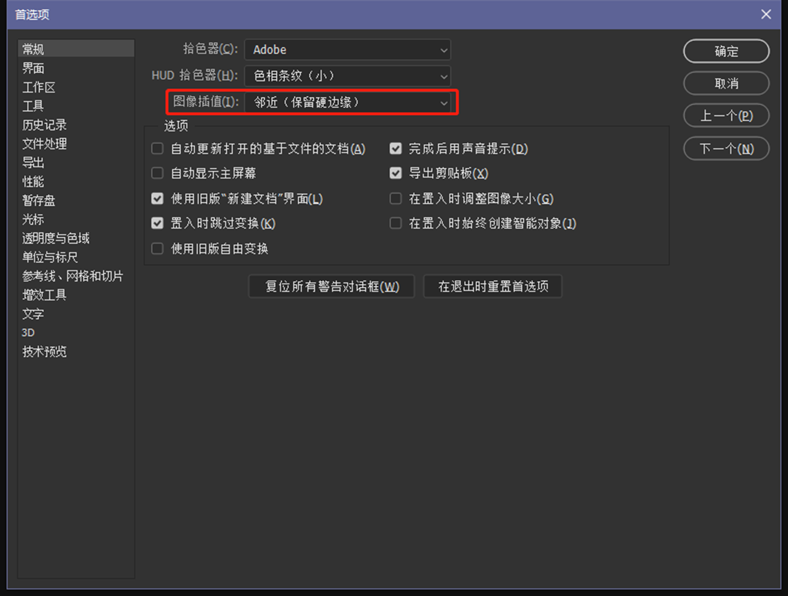

# Whiteverse 设计标准

## 环境配置

- Photoshop 版本大于 2020
- 将图像插值调整为邻近
  
- 将高速缓存级别调至 2，高速缓存拼贴大小调至 128k，历史记录随意（取决于用户电脑配置）。
  
- 将标尺与文字单位调整为像素
  
- 使用铅笔工具绘画，关闭平滑，否则会导致画笔延迟漂移
  
- 使用油漆桶进行范围填色，容差调整为 0，禁用消除锯齿，连续选项视情况而定
  
- 使用橡皮工具进行修改，切换到铅笔模式
  
- 在执行图像缩放时，需要注意三点：
  - 为保证放大的像素不因奇偶差异而变形，应当通过调整图像的放大中心为左上 👉 使其 XY 坐标定位达到像素精确（例：10.00 像素）。
  - 应当使图像的放大倍数为整数倍，如 200%、300%，而非 150%或 112%
  - 插值必须调整为邻近
    

## 绘图习惯

### 图层

- 不同物体需要分层。
- 在设计上有特别的的叠压关系时应当单独分图层，如侧面的阳台。
- 允许合层的情况：

  - 不影响结构整体性的
  - 不影响或没有交互方式的
  - 可以作为整体 SpriteSheet 裁切的

- 图层命名必须统一且明确，名称采用大驼峰，并用下划线连接名称和它的属性，如 Shadow、Back、Front、Frame 等字段。出现“拷贝”等名称是**不被允许**的，这样的图层不应当加入导出序列，仅用作指示画面效果。

- 可以定义图层名称属性的缩写，应当说明。以下是一些常用的缩写和意义：
  |缩写|英文|含义|
  |---|---|---|
  | b |back |背后 |
  | f |front |前，可省略 |
  | s |side| 侧面 |
  | w |shadow |投影 |
  | t |texture |材质、纹理 |

### 绘制

- 在设计时应当保留物品的边缘尺寸，以便于在游戏中添加自动描边。举例说明：在绘制一个 32x32 的物品时，应当在物品的边缘留出 1px 的空白，也就是说物品的实际尺寸为 30x30，这样在游戏中添加描边时就不会出现物品之间的重叠。
- 以下情况**绝不允许**：
  - 使用现实的图片直接作为底图描绘，再在上面进行修改。
  - 除非有特殊需求，绘制时半透明笔刷直接出现在画布上。这会导致游戏中颜色自动描边后的异常混合。

## 地牢饿徒

### 建筑

- 屋顶单独分层，为了屋顶的差异化和自定义。
- 在基本框架绘制完毕后绘制纹理层#tex，以保护原有结构色彩。
- 屋顶在绘制时，统一采用亮色进行绘制，并在完毕前将右侧房顶亮度调低 50。
- 投影一般情况位于建筑形状下方 5 格，比两侧各多 2 格，多出的 1 格是照顾到系统自动描边遮挡。

#### 建筑物的 Unity 导入注意事项

- 注意在 GameObject 命名时，应当使用大驼峰命名法，如：House、Wall、Roof 等。
- 命名时，应当注意保留名称字段。
  以下是一些常用的字段和意义：
  |字段|含义|
  |---|---|
  | Shadow(#Shadow)| 投影，在 MapRenderer 预处理过程中将不会进行描边 |
  | #tex |材质纹理，用于保护原有结构色彩 |
  | #Light | 灯光物体，仅用于保存 Light 2D 灯光效果 |

- 导入图片时，由于图片大小的不确定性和重复修改性，不建议保存为 SpriteSheet，而是直接导入单张图片，以便于后续的修改。

- 请使用我们提供的工具进行导入后的预处理，16x 加透明描边。
- 关于描边：

  我们提供了两种材质：UnitOutline 和 UnitWithoutLine。前者是带有描边的，后者是不带描边的。在导入时，应当根据实际需求选择。

  描边遵循以下规则：

  - 每一个 Prefab 是一个描边整体，在整体中的任何物体都将共享整体的最大边缘描边。也就是说，如果将一个已经描边的预制体放进另一个预制体中，那么这个预制体的描边将会被覆盖。

  - 如果预设了描边，那么在游戏中就忽略这项描边工作。为保证一致性，笔者建议在导入、制作 Prefab 时不要预设描边，把工作交给自动化，做好标记即可。如果已经预设了描边 UnitOutline，理论上不会有影响，但还是建议不要过多预设描边。

  - 严格区分动态和静态物体，动态物体指会在游戏中产生位移、角度、尺寸或开关变化的物体。标记静态的方法是在静态物体的 Prefab 根目录添加一个名为 $ 的空物体。

    静态物体作为一个整体，它的描边将会被应用到整个物体上，并且在游戏加载后不再修改。动态物体的描边则会在游戏运行时动态生成。
