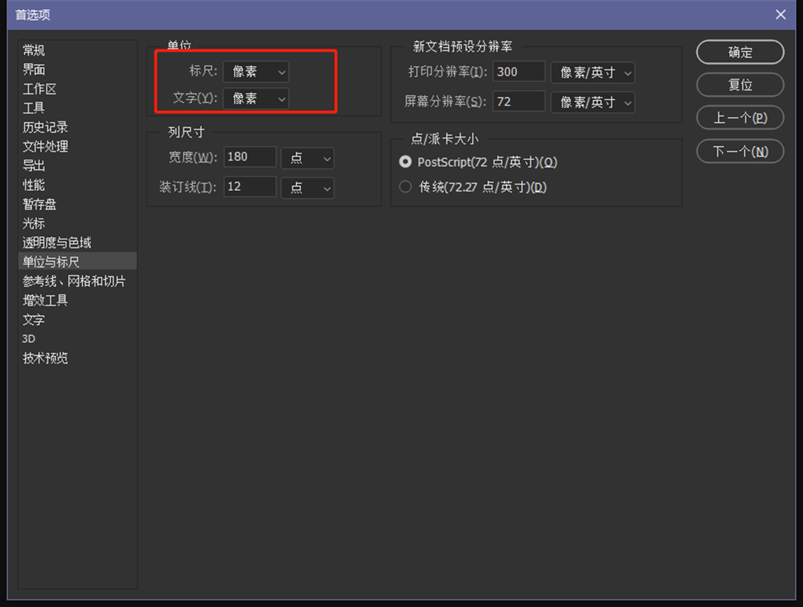

# Whiteverse 设计标准

## 环境配置

- Photoshop 版本大于 2020
- 将图像插值调整为邻近
  
- 将高速缓存级别调至 2，高速缓存拼贴大小调至 128k，历史记录随意（取决于用户电脑配置）。
  
- 将标尺与文字单位调整为像素
  
- 使用铅笔工具绘画，关闭平滑，否则会导致画笔延迟漂移
  
- 使用油漆桶进行范围填色，容差调整为 0，禁用消除锯齿，连续选项视情况而定
  
- 使用橡皮工具进行修改，切换到铅笔模式
  
- 在执行图像缩放时，需要注意三点：
  - 为保证放大的像素不因奇偶差异而变形，应当通过调整图像的放大中心为左上 👉 使其 XY 坐标定位达到像素精确（例：10.00 像素）。
  - 应当使图像的放大倍数为整数倍，如 200%、300%，而非 150%或 112%
  - 插值必须调整为邻近
    

## 绘图习惯

### 图层

- 不同物体需要分层。
- 在设计上有特别的的叠压关系时应当单独分图层，如侧面的阳台。
- 允许合层的情况：

  - 不影响结构整体性的
  - 不影响或没有交互方式的
  - 可以作为整体 SpriteSheet 裁切的

- 图层命名必须统一且明确，名称采用大驼峰，并用下划线连接名称和它的属性，如 Shadow、Back、Front、Frame 等字段。出现“拷贝”等名称是**不被允许**的，这样的图层不应当加入导出序列，仅用作指示画面效果。

- 可以定义图层名称属性的缩写，应当说明。以下是一些常用的缩写和意义：
  |缩写|英文|含义|
  |---|---|---|
  | b |back |背后 |
  | f |front |前，可省略 |
  | s |side| 侧面 |
  | w |shadow |投影 |
  | t |texture |材质、纹理 |

## 地牢饿徒

### 建筑

- 屋顶单独分层，为了屋顶的差异化和自定义。
- 在基本框架绘制完毕后绘制纹理层#tex，以保护原有结构色彩。
- 屋顶在绘制时，统一采用亮色进行绘制，并在完毕前将右侧房顶亮度调低 50。
- 投影一般情况位于建筑形状下方 5 格，比两侧各多 2 格，多出的 1 格是照顾到系统自动描边遮挡。
